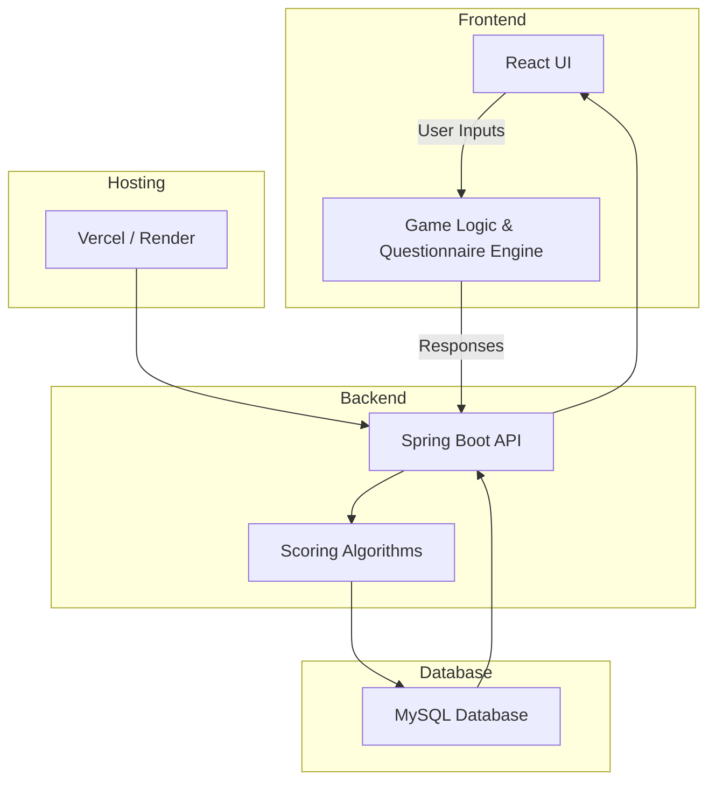
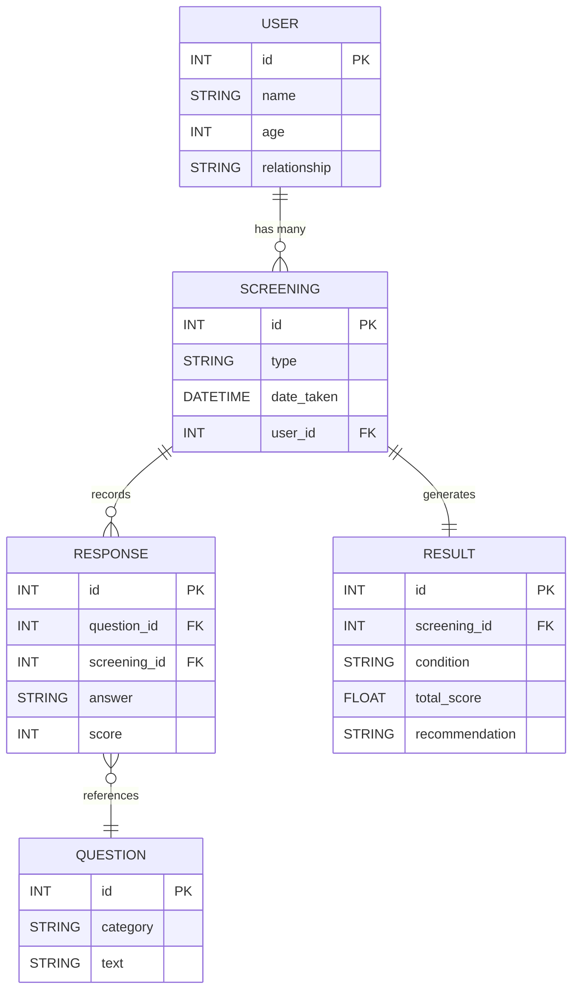
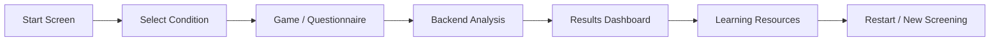
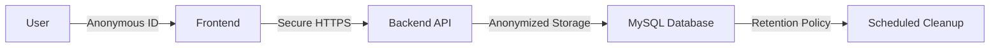

# 🧩 NeuroCheck

[](https://youtu.be/Wi13vPI1PEc?si=p96PEYjSKlndkNA-)
[](#)
[](#)
[](LICENSE)
[](#-technology-stack)

**NeuroCheck** is a fun, educational web app that helps identify early signs of **Autism, ADHD, and Dyslexia** using a combination of **scientific questionnaires** and **interactive, game-based assessments**.  
It is designed to promote awareness, inclusion, and early support for children with neurodiverse needs.

---

## 🌈 Features

- 🧠 **Checklist-based Screeners** — Autism, ADHD, and Dyslexia  
- 🎮 **Gamified Mini-Tests** — Fun interactive activities that assess focus, attention, and memory  
- 📊 **Instant Results Report** — Printable and easy-to-understand summaries  
- 🌍 **Resource Library** — Links to national and local neurodiversity support organizations  
- 🔐 **Privacy First** — No user data transmitted  

---

## 💡 Inspiration

This project was inspired by **Saanvi Naik’s** volunteering work at *Stable Influence*, a therapeutic horse-riding center where children with autism and other developmental conditions come for equine therapy.  
Seeing the positive change early intervention brought to these children motivated her to create a digital tool that helps families begin the journey toward awareness and support.

---

## 🧩 Technology Stack

| Layer | Technology | Description |
|-------|-------------|-------------|
| **Frontend** | React + Framer Motion | Responsive, animated user interface |
| **Backend** | Spring Boot (Java) | REST APIs and screening logic |
| **Database** | MySQL | Stores screening data and configurations |
| **Deployment** | Vercel + Render | Fast, free hosting for CAC submission |

---

## 🧠 System Overview

NeuroCheck follows a **modular, secure client–server architecture** designed for accessibility, scalability, and privacy.  
It connects interactive front-end modules with a robust back-end that performs logic scoring and returns personalized feedback.

---

### ⚙️ Scoring Algorithms (Patent-Protected)

NeuroCheck uses a structured scoring framework that combines **scientific questionnaires** and **interactive task results** to generate indicative scores for Autism, ADHD, and Dyslexia.  
Each response and gameplay action contributes to weighted categories such as **focus**, **reading awareness**, and **attention span**, which are then compiled into a **condition-specific index**.

> 🧩 *The detailed computation model, weighting logic, and normalization process are part of the **patent-pending NeuroCheck Early Screening System (US 63/958,427)** and are not publicly disclosed.*

---

### 🧩 Detailed Architecture



---

### 🔢 Database Model (ER Diagram)



---

### 🗂️ Data Schema Description

| Table | Purpose | Key Columns |
|--------|----------|-------------|
| **USER** | Stores parent/child information | `id`, `name`, `age`, `relationship` |
| **SCREENING** | Represents a single screening session | `id`, `type`, `date_taken`, `user_id` |
| **QUESTION** | Contains all questions for each condition | `id`, `category`, `text` |
| **RESPONSE** | Links user answers to questions | `question_id`, `screening_id`, `score` |
| **RESULT** | Stores summary and recommendations | `screening_id`, `condition`, `total_score` |

---

### 📱 Screening Flow



---

### 🔒 Data Privacy


---

## 🚀 Deployment Links

| Component | URL |
|------------|-----|
| **GitHub Repo** | [https://github.com/saanvirnaik/neurocheck](https://github.com/saanvirnaik/neurocheck) |
| **Demo Video** | [Watch on YouTube](https://youtu.be/Wi13vPI1PEc?si=p96PEYjSKlndkNA-) |

---

## 🔧 Installation (Local Development)

### Frontend
```bash
cd frontend
npm install
npm start
```

### Backend
```bash
cd backend
mvn clean install
mvn spring-boot:run
```

---

## 📄 License
This project is licensed under the **MIT License** — see the [LICENSE](LICENSE) file for details.

---

> 🧩 *Developed and submitted by **Saanvi Naik** for the 2025 Congressional App Challenge.*  
> *Patent No: **US 63/958,427 – NeuroCheck Early Screening System (Patent Pending).***  
> *Inspired by volunteering at Stable Influence Therapeutic Riding Center.*

